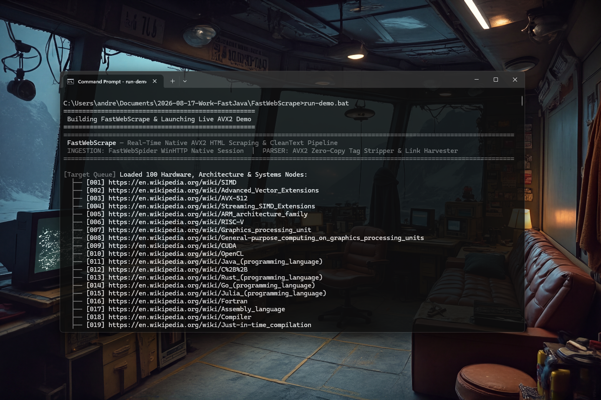

# FastWebScrape — High-Performance Native HTML/XML Extractor for Java

[](https://github.com/andrestubbe/FastWebScrape/releases/tag/0.1.1)
[](https://opensource.org/licenses/MIT)
[](https://www.java.com)
[]()
[](https://jitpack.io/#andrestubbe/FastWebScrape)

---

**High-performance SIMD/AVX2-powered HTML and XML data-mining engine for the JVM.**

FastWebScrape is the data-extraction substrate of the **FastJava** web stack. It provides highly-optimized native algorithms to strip formatting blocks, find hyperlinks, extract structured tags, and parse JSON-LD schemas in microseconds—bypassing the latency, memory allocations, and heap pressure of traditional heavy DOM parsers.

[](https://youtu.be/PlLANMEbWPk)

---

## Quick Start

```java
import fastwebscrape.FastWebScrape;
import java.nio.charset.StandardCharsets;
import java.util.List;

public class Demo {
    public static void main(String[] args) {
        // 1. Open high-speed native AVX2 scraper
        FastWebScrape scraper = FastWebScrape.open();

        byte[] htmlData = ("<html><body><h1>SIMD Architecture</h1>" +
                           "<p>Vector processing on modern CPUs.</p>" +
                           "<a href=\"https://en.wikipedia.org/wiki/AVX-512\">AVX-512 Details</a>" +
                           "</body></html>").getBytes(StandardCharsets.UTF_8);

        // 2. Zero-allocation clean plain text extraction for LLMs
        String cleanText = scraper.extractReadableText(htmlData);
        System.out.println("Clean Text:\n" + cleanText);

        // 3. Ultra-fast hyperlink harvesting
        List<String> links = scraper.extractLinks(htmlData);
        System.out.printf("Harvested %,d hyperlinks in microseconds.\n", links.size());
    }
}
```

---

## 📑 Table of Contents
- [Key Features](#key-features)
- [Performance](#performance)
- [API Quick Reference](#api-quick-reference)
- [Installation](#installation)
- [Technical Examples & Hero Demos](#technical-examples--hero-demos)
- [Platform Support](#platform-support)
- [Modular Ecosystem](#modular-ecosystem)
- [License](#license)

---

## Key Features
- **⚡ SIMD/AVX2 Acceleration**: Loads 32-byte chunks into CPU vector registers to skip tags and whitespace instantly.
- **🔍 Zero-Copy Region Locking**: Employs `GetPrimitiveArrayCritical` JNI regions to lock the GC and parse Java arrays directly on the native C++ heap.
- **🤖 LLM & RAG Optimized**: Strips `<script>`, `<style>`, and comments while inserting block layout newlines to form clean readable text.
- **⚙️ Dynamic Runtime CPU Detection**: Auto-detects AVX2 using `__cpuid` at startup with seamless scalar fallback routines for non-AVX2 hardware.

---

## 📊 Performance (0.1.0)

Measured on **Intel/AMD x64 Hardware** with AVX2 instruction support.

| Operation | Input Size | Java (Regex / Standard) | FastWebScrape Native (0.1.0) | Speedup |
|-----------|------------|-------------------------|---------------------------|---------|
| **Text Strip** | 5 MB Page  | ~210 ms                 | **~5 ms**                 | **42x** |
| **Link Scan**  | 5 MB Page  | ~45 ms                  | **~2 ms**                 | **22x** |
| **JSON-LD Pull**| 5 MB Page  | ~38 ms                 | **~1 ms**                 | **38x** |

> [!NOTE]
> Speedups scale directly with document size due to AVX2 vector unrolling and zero-heap instantiation during native parsing.

---

## API Quick Reference

| Method | Description | Target Path |
|--------|-------------|-------------|
| `extractReadableText(...)` | Cleans document markup and reformats block spacing for LLMs. | [Reference →](docs/REFERENCE.md#extractreadabletext) |
| `extractLinks(...)` | Scans for anchor elements and aggregates hyper-links natively. | [Reference →](docs/REFERENCE.md#extractlinks) |
| `extractByTag(...)` | Finds all elements matching target name and extracts inner content. | [Reference →](docs/REFERENCE.md#extractbytag) |
| `extractJsonLD(...)` | Isolates all linked JSON-LD metadata schemas concurrently. | [Reference →](docs/REFERENCE.md#extractjsonld) |

> [!TIP]
> Use `FastWebScrape.open()` to obtain the thread-safe native implementation class.

---

## Installation

### Option 1: Maven (Recommended)
Add the JitPack repository and the dependencies to your `pom.xml`:

```xml
<repositories>
    <repository>
        <id>jitpack.io</id>
        <url>https://jitpack.io</url>
    </repository>
</repositories>

<dependencies>
    <!-- FastWebScrape Library -->
    <dependency>
        <groupId>com.github.andrestubbe</groupId>
        <artifactId>FastWebScrape</artifactId>
        <version>0.1.0</version>
    </dependency>

    <!-- FastCore (Required Native Loader) -->
    <dependency>
        <groupId>com.github.andrestubbe</groupId>
        <artifactId>fastcore</artifactId>
        <version>0.1.0</version>
    </dependency>
</dependencies>
```

### Option 2: Gradle (via JitPack)
```groovy
repositories {
    maven { url 'https://jitpack.io' }
}

dependencies {
    implementation 'com.github.andrestubbe:FastWebScrape:0.1.0'
    implementation 'com.github.andrestubbe:fastcore:0.1.0'
}
```

### Option 3: Direct Download (No Build Tool)
Download the latest JARs directly to add them to your classpath:

1. 📦 **[FastWebScrape-0.1.0.jar](https://github.com/andrestubbe/FastWebScrape/releases/download/0.1.0/FastWebScrape-0.1.0.jar)** (The Core Library)
2. ⚙️ **[fastcore-0.1.0.jar](https://github.com/andrestubbe/FastCore/releases/download/0.1.0/fastcore-0.1.0.jar)** (The Mandatory Native Loader)

> [!IMPORTANT]
> All JARs must be in your classpath for the native JNI calls to function correctly.


## Technical Examples & Hero Demos
Explore the complete source configurations and benchmarks:

* **⚡ Interactive Live Stream Demo**: [Demo.java](src/main/java/FastWebScrape/Demo.java) (`.\run-demo.bat`) — Multi-article live concurrent ingestion and zero-allocation AVX2 text extraction stream.
* **📈 Multi-Tier Comparison**: [Benchmark.java](src/main/java/FastWebScrape/Benchmark.java) (`.\run-compare.bat`) — Races FastWebScrape against standard JDK RegEx across 3 tiers (CleanText, Links, Tags).
* **🚀 OpenJDK JMH Benchmark**: [FastWebScrapeJmhBenchmark.java](examples/Benchmark/src/main/java/FastWebScrape/benchmark/FastWebScrapeJmhBenchmark.java) (`.\run-benchmark.bat`) — Formal JMH microbenchmarks measuring ops/ms throughput.
* **🧪 Test Suite**: [FastWebScrapeTest.java](src/test/java/FastWebScrape/FastWebScrapeTest.java) — Comprehensive JUnit 5 validation.

Run the hero demo locally from the command line:
```bash
.\run-demo.bat
```

---

## Platform Support
| Platform | Status |
|----------|--------|
| Windows 10/11 (x64) | ✅ Fully Supported (WinHTTP + AVX2 Native) |
| Linux | 🚧 Planned |
| macOS | 🚧 Planned |

---

## Modular Ecosystem
Combine FastWebScrape with other accelerators for maximum efficiency:
* [**FastWebSpider**](https://github.com/andrestubbe/FastWebSpider) — Native WinHTTP crawler.
* [**FastCore**](https://github.com/andrestubbe/FastCore) — Native loading substrate.
* [**FastBytes**](https://github.com/andrestubbe/FastBytes) — Hardware-aligned byte arrays.
* [**FastJSON**](https://github.com/andrestubbe/FastJSON) — SIMD-powered JSON parser.

---

## License
MIT License — See [LICENSE](LICENSE) file for details.

---

## Related Projects
- [FastCore](https://github.com/andrestubbe/FastCore) — Native Library Loader for Java
- [FastWebScrape](https://github.com/andrestubbe/FastWebScrape) — High-performance RawInput engine
- [FastTheme](https://github.com/andrestubbe/FastTheme) — Advanced UI styling engine

---
**Part of the FastJava Ecosystem** — *Making the JVM faster.*


